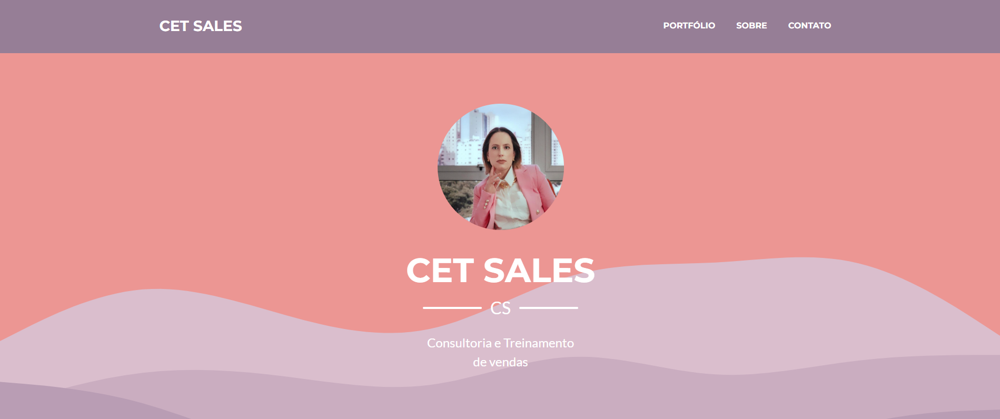

# Cet Sales - Consultoria e Treinamento de Vendas

<p align="center">
  
</p>

## Sobre o Projeto

Cet Sales é uma empresa especializada em consultoria e treinamentos de vendas, localizada em Campinas, Brasil. Nosso objetivo é ajudar empresas, empresários e investidores a maximizar seus lucros com estratégias eficazes de vendas.

## Tecnologias Utilizadas

O projeto foi desenvolvido utilizando as seguintes tecnologias:

-   **HTML5**
-   **CSS3 e Bootstrap 5** (para estilização e responsividade)
-   **JavaScript**
-   **Google Fonts** (Fonte Montserrat)
-   **Font Awesome** (Ícones)

## Estrutura do Projeto

```
cet-sales/
│── index.html  # Página principal
│── LICENSE  # Licença do projeto
│── README.md  # Documentação
│── public/
│   │── assets/
│   │   │── fonts/  # Arquivos de fontes
│   │   │── images/  # Imagens utilizadas no site
│   │   │── scripts/  # Scripts JavaScript
│   │   │── styles/  # Arquivos de estilo CSS
```

## Funcionalidades

-   **Página Responsiva**: Adaptável para diferentes dispositivos.
-   **Seções informativas**: Apresentação da empresa, portfólio e contato.
-   **Links para redes sociais**: WhatsApp, Instagram e LinkedIn.

## Como Rodar o Projeto Localmente

1. Clone o repositório:
    ```sh
    git clone https://github.com/seu-usuario/cet-sales.git
    ```
2. Acesse a pasta do projeto:
    ```sh
    cd cet-sales
    ```
3. Abra o arquivo `index.html` no navegador.

## Licença

Este projeto está licenciado sob a licença MIT - veja o arquivo [LICENSE](LICENSE) para mais detalhes.
